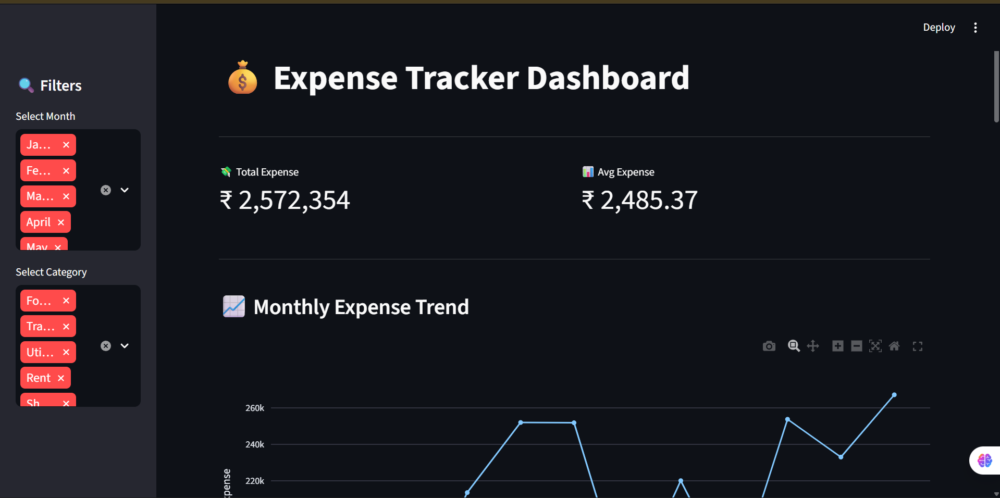
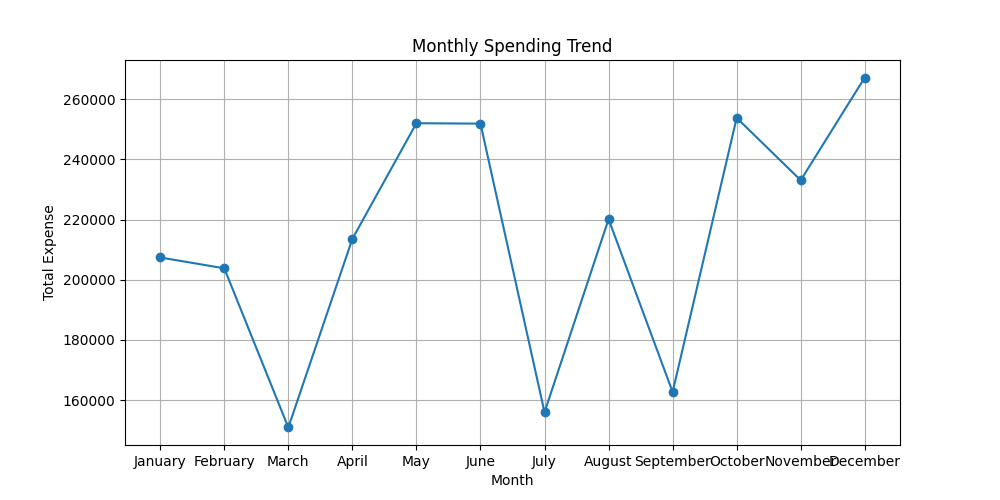
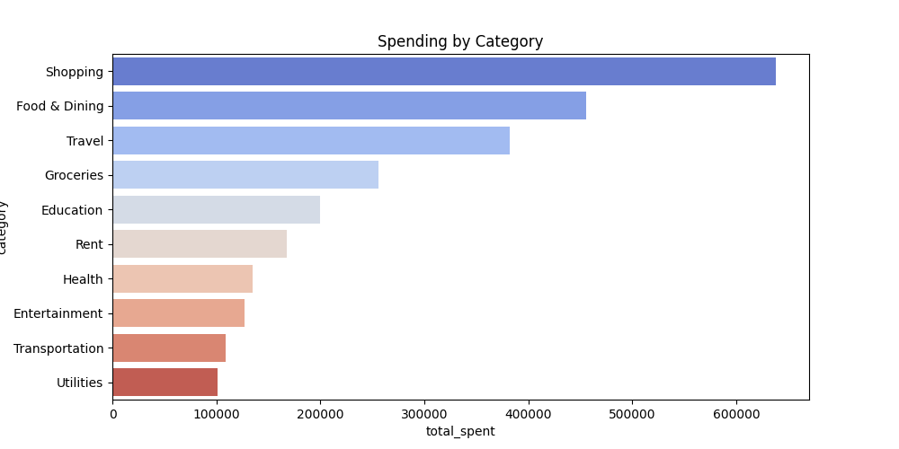
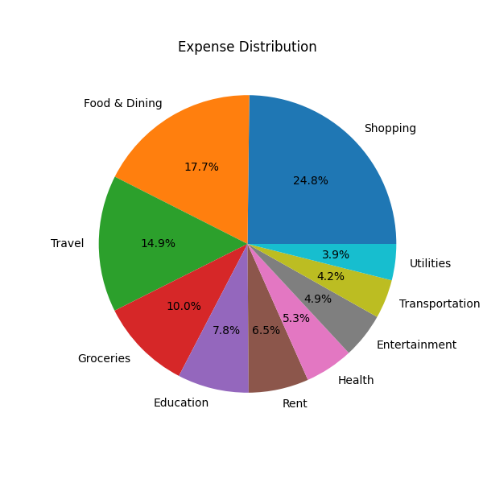
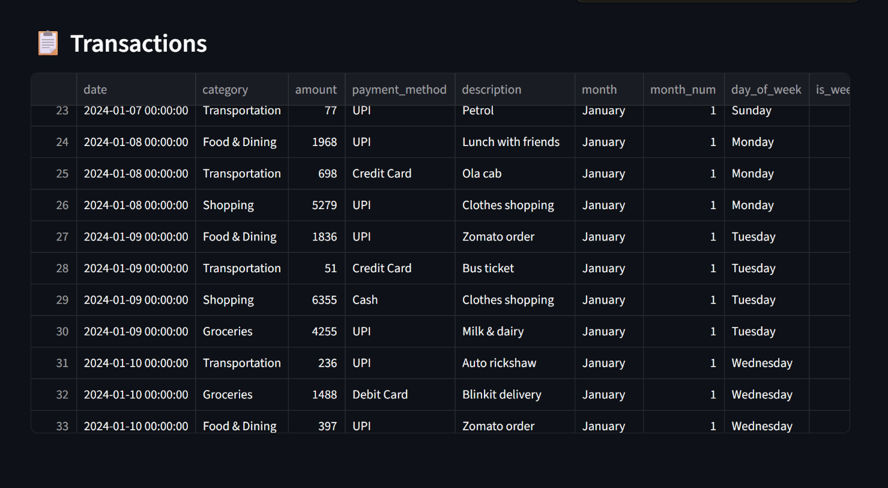

# 💰 Expense Tracker App using Data Science


> A data-driven personal finance application that tracks, categorizes,
> and visualizes expenses — enabling smarter financial decisions through
> analytics and an interactive Streamlit dashboard.

---

## 🖥️ Dashboard Preview

### 🏠 Home — KPI Metrics & Monthly Trend
<p align="center">
  
  <br/>
  <em>Total expense overview with monthly trend line chart</em>
</p>

---

### 📈 Monthly Expense Trend
<p align="center">
  
  <br/>
  <em>Month-by-month spending pattern across all 12 months of 2024</em>
</p>

---

### 📊 Category-wise Spending
<p align="center">
  
  <br/>
  <em>Horizontal bar chart — Shopping leads total spend at ₹6L+</em>
</p>

---

### 🥧 Expense Distribution
<p align="center">
  
  <br/>
  <em>Interactive pie chart — Shopping (24.8%) and Food & Dining (17.7%) are top categories</em>
</p>

---

### 💡 Insights & Transactions
<p align="center">
  
  <br/>
  <em>AI-powered spending insights with filterable transaction table</em>
</p>

---

## 🎯 Project Overview

Managing personal finances is a challenge for millions of people.
This project simulates a real-world **FinTech expense tracking system**
using Python and Data Science — the same kind of system used by
Google Pay, CRED, Mint, Paytm, and Razorpay.

**Built for:** Placement portfolio | Data Analyst | Business Analyst | Financial Analyst roles

---

## 🔬 Tech Stack

| Layer | Technology |
|-------|------------|
| Language | Python 3.11 |
| Dashboard | Streamlit |
| Data Processing | Pandas, NumPy |
| Visualization | Plotly, Matplotlib, Seaborn |
| Data Storage | CSV (flat file) |
| Dataset | Synthetic Expense Data (900+ transactions) |

---

## 📁 Project Structure

```
Expense-Tracker-App/
│
├── data/
│   ├── generate_expenses.py     # Synthetic data generator
│   ├── expenses.csv             # Raw transactions (900+ rows)
│   └── monthly_summary.csv      # Income vs savings per month
│
├── src/
│   ├── preprocess.py            # Cleaning & feature engineering
│   └── eda.py                   # EDA charts generation
│
├── outputs/
│   ├── expenses_clean.csv       # Cleaned & engineered dataset
│   ├── category_summary.csv     # Spend per category
│   ├── payment_summary.csv      # Payment method breakdown
│   ├── monthly_budget_status.csv# Budget alerts per month
│   └── monthly_summary.csv      # Income vs savings
│
├── images/                      # Dashboard screenshots & EDA charts
│
├── app.py                       # Streamlit dashboard
├── main.py                      # Full pipeline runner
├── requirements.txt             # Dependencies
└── README.md
```

---

## ⚙️ Installation & Setup

```bash
# 1. Clone the repository
git clone https://github.com/YOUR_USERNAME/Expense-Tracker-App.git
cd Expense-Tracker-App

# 2. Create virtual environment
python -m venv venv
venv\Scripts\activate        # Windows
source venv/bin/activate     # Mac/Linux

# 3. Install dependencies
pip install -r requirements.txt

# 4. Run full pipeline
python main.py

# 5. Launch dashboard
streamlit run app.py
```

---

## 🚀 How to Run

### Option A — Full Pipeline (recommended first time)
```bash
python main.py
```
Runs: data generation → cleaning → feature engineering → EDA → insights

### Option B — Dashboard only (after pipeline runs once)
```bash
streamlit run app.py
```

---

## 📊 Dataset Details

| Property | Value |
|----------|-------|
| Time Period | January 2024 — December 2024 |
| Total Transactions | 900+ |
| Categories | 10 (Food, Rent, Travel, Shopping, etc.) |
| Payment Methods | UPI, Credit Card, Debit Card, Cash, Net Banking |
| Monthly Income | ₹75,000 |
| Data Type | Synthetic (realistic seasonal patterns) |

### 🗂️ Categories & Budgets

| Category | Monthly Budget | Type |
|----------|---------------|------|
| Rent | ₹13,000 | Essential |
| Groceries | ₹8,000 | Essential |
| Food & Dining | ₹8,000 | Non-Essential |
| Transportation | ₹4,000 | Essential |
| Shopping | ₹10,000 | Non-Essential |
| Entertainment | ₹5,000 | Non-Essential |
| Health | ₹8,000 | Essential |
| Education | ₹12,000 | Essential |
| Utilities | ₹5,000 | Essential |
| Travel | ₹15,000 | Non-Essential |

---

## 🧠 Key Features

### 📐 Feature Engineering
- **`quarter`** — Q1/Q2/Q3/Q4 seasonal grouping
- **`expense_size`** — Small / Medium / Large / Very Large buckets
- **`is_essential`** — Needs vs Wants classification
- **`cumulative_monthly_spend`** — Monthly burn rate tracker
- **`vs_monthly_avg`** — Flags unusually high transactions
- **`week_part`** — Weekday vs Weekend spending pattern

### 🚨 Budget Alert System
- 🟢 **ON TRACK** — more than ₹1,000 under budget
- 🟡 **NEAR LIMIT** — within ₹1,000 of budget
- 🔴 **OVER BUDGET** — exceeded monthly budget

### 📈 Seasonal Patterns Built In
- Travel spikes in **May, June, December**
- Shopping peaks in **October–December** (festive season)
- Weekend spending **20–60% higher** for Food, Shopping, Entertainment

---

## 💡 Key Insights from the Dashboard

- 🛍️ **Shopping** is the highest spending category at **24.8%** of total
- 🍽️ **Food & Dining** is second at **17.7%** of total spend
- ✈️ **Travel** shows strong seasonal spikes in May–June and December
- 📱 **UPI** is the most used payment method (40% of transactions)
- 📅 **December** has the highest monthly spend due to festive + travel
- 💰 Average spend per transaction: **₹2,485**

---

## 💼 Real-World Use Cases

| Use Case | How This Project Covers It |
|----------|---------------------------|
| Personal budgeting | Monthly budget vs actual tracking |
| Spending categorization | 10 category classification system |
| Financial planning | Income vs savings analysis |
| FinTech dashboards | Interactive Streamlit + Plotly UI |
| Business expense monitoring | Essential vs Non-Essential split |

---


## 🔮 Future Improvements

- [ ] Connect to real bank API (Plaid, Razorpay)
- [ ] Add ML anomaly detection for unusual transactions
- [ ] SMS/email budget alert notifications
- [ ] Multi-user support with login system
- [ ] Export reports as PDF
- [ ] Mobile-responsive UI

---

## 👤 Author

NEHA JOSHI 
- GitHub: https://github.com/Neha-Joshi05/Expense-Tracker-Dashboard.git
- LinkedIn: https://www.linkedin.com/in/neha-joshi-0851a2322?utm_source=share_via&utm_content=profile&utm_medium=member_android

---

## 🙏 Acknowledgements

Special thanks to **Umesh Yadav** for mentorship, guidance,
and constant support throughout this project.

---

⭐ **Star this repo if you found it useful!**